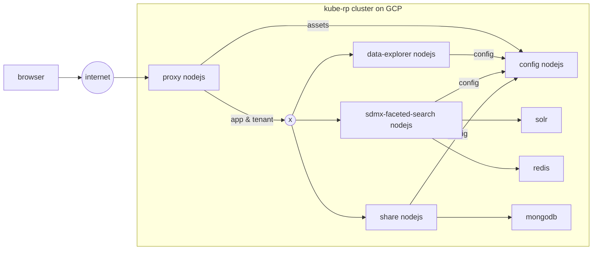
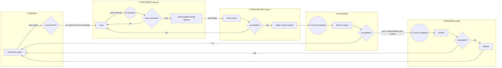

# Manifest

> Dashboard for dotstatsuite applications and components, gitlab `Operations` only works for public repositories.

|kind|name|status|coverage|
|---|---|---|---|
|service|[config](https://gitlab.com/sis-cc/.stat-suite/dotstatsuite-config)|||
|service|[sdmx-faceted-search](https://gitlab.com/sis-cc/.stat-suite/dotstatsuite-sdmx-faceted-search)|||
|service|[proxy](https://gitlab.com/sis-cc/.stat-suite/dotstatsuite-proxy)|||
|webapp|[data-explorer](https://gitlab.com/sis-cc/.stat-suite/dotstatsuite-data-explorer)|||
|webapp|[data-explorer-legacy](https://gitlab.com/sis-cc/.stat-suite/dotstatsuite-data-explorer-legacy)|||
|webapp|[data-lifecycle-manager](https://gitlab.com/sis-cc/.stat-suite/dotstatsuite-data-lifecycle-manager)|||
|webapp|[data-viewer-legacy](https://gitlab.com/sis-cc/.stat-suite/dotstatsuite-data-viewer-legacy)|||
|package|[components](https://gitlab.com/sis-cc/.stat-suite/dotstatsuite-components)|||
|package|[ui-components](https://gitlab.com/sis-cc/.stat-suite/dotstatsuite-ui-components)|||
|package|[d3-charts](https://gitlab.com/sis-cc/.stat-suite/dotstatsuite-d3-charts)|||
|package|[ui-header](https://gitlab.com/sis-cc/.stat-suite/dotstatsuite-ui-header)|||
|package|[ui-footer](https://gitlab.com/sis-cc/.stat-suite/dotstatsuite-ui-footer)|||

# architecture

# DevOps

## git-flow

see [git-flow](http://nvie.com/posts/a-successful-git-branching-model/)

## pipelines

> pipelines are defined in `.gitlab-ci.yml`, each repository has its own pipeline definition

### webapp/service

### package

*tags are only on commits in master

## kanban

**legend:**
- rectangle: action
- circle: automated action
- diamond: decision

**notes:**
- REVIEW by JB and/or Mike and/or Dimitri and/or Nico
- IMPLEMENT by Mike, Dimitri or Nico
- PEER REVIEW by nico
- QA by JB
- release branches are used as buffers to avoid freezing develop when the release is big

|---|---|---|---|
|index|step|actions|decisions|
|1|review|brainstorm specs| is production?|
|2|implement|code, handle merge request|is done?|
|3|peer review|code review, apply merge request|is acceptable|
|4|qa|feature review|is acceptable|
|5|release|monitor|-|
