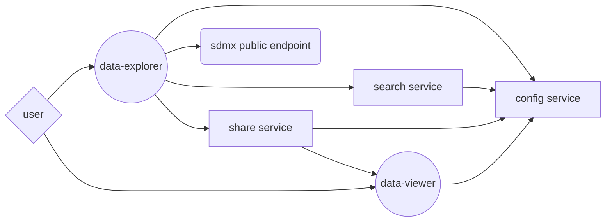
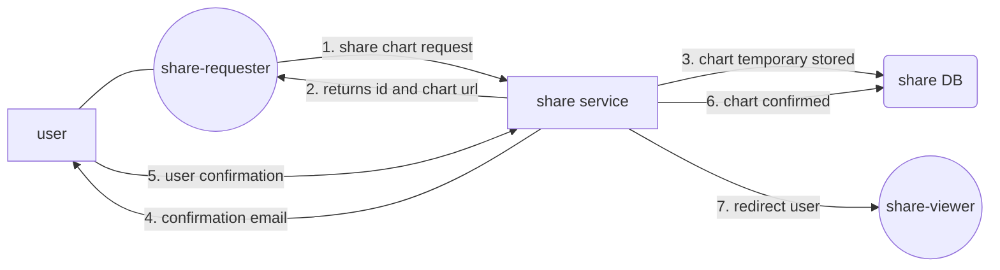
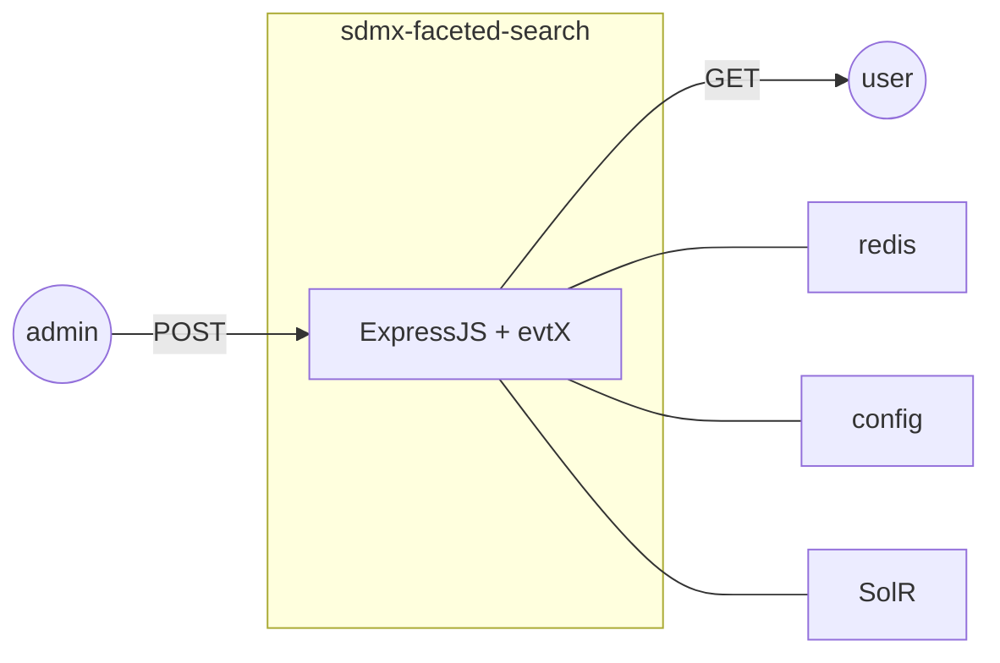
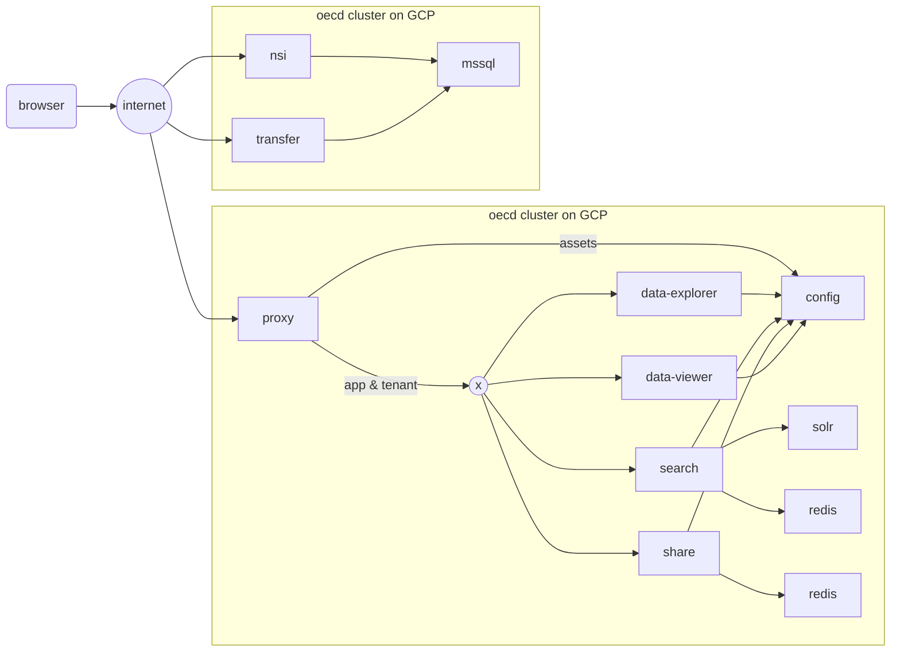
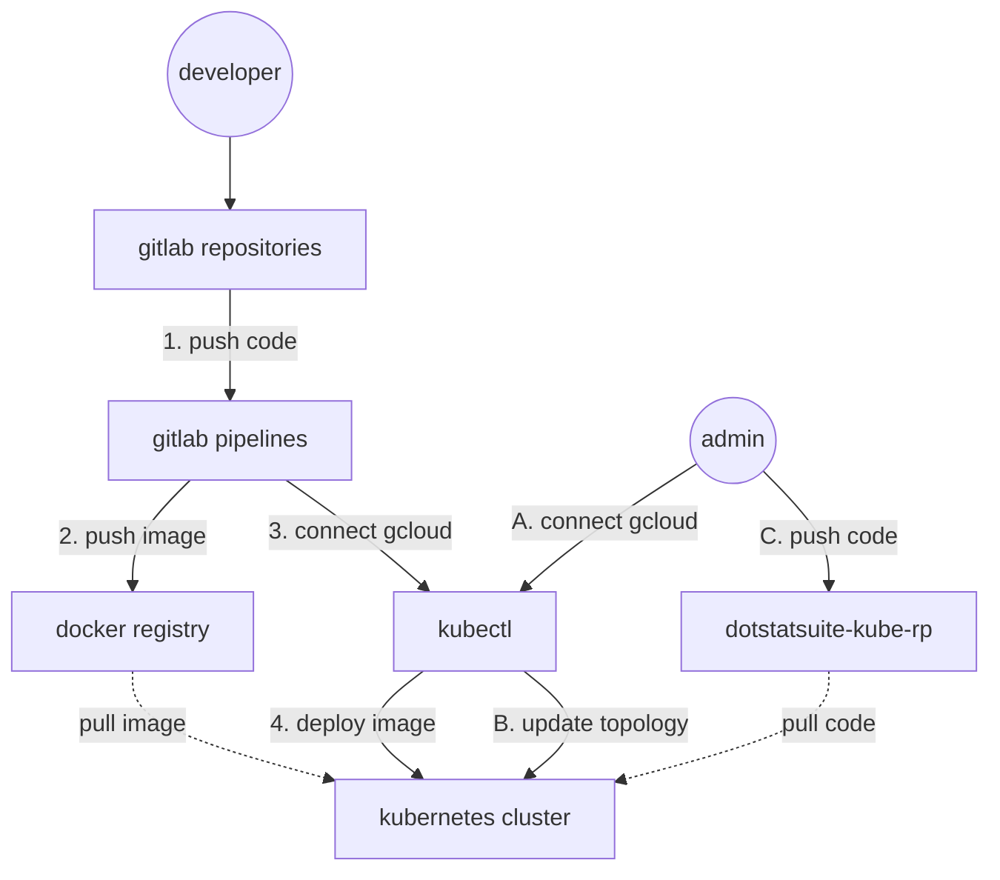
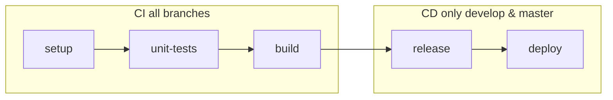
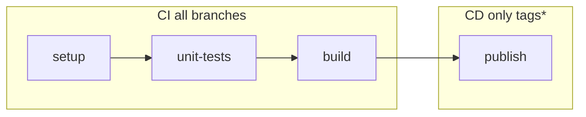

# Introduction

The .Stat Suite is a standard-based, componentised, open source platform for the efficient production and dissemination of high-quality statistical data. The product is based on the General Statistical Business Process Model (GSBPM) and the Statistical Data and Metadata eXchange (SDMX) standards and is driven by the Statistical Information System Collaboration Community (SIS-CC).

The .Stat Suite has three **main modules**: 

* **.Stat Core**: A highly performing, secure SDMX back-end based on standard protocols, to store, process and retrieve statistical data, structural and referential metadata, data process information and security settings.
 
* **.Stat Data Lifecycle Manager**: A set of adaptive back-office modules to efficiently and timely produce and (re-)use high quality statistical data by defining, running, automating, controlling and evaluating the underlying data processes.
 
* **.Stat Data Explorer**: A front-office application for easy finding, understanding and using of data through an efficient well-tuned navigation and search approach, appropriate data previews and contextual metadata, and download in standard formats, APIs or share features.

Each main module (as well as their components) can be used together or separately.
In the following are a few typical use cases on how an organisation can make use of these modules:

**A) Adding the Data Explorer to an existing fully-fledshed back-end solution**

*Pre-requisites*: A statistical database with its own data management features and with a public SDMX API (SDMX 2.1 Rest incl. SDMX-JSON); hardware (see the system requirements in the installation guides)

*Objectives*: Add a public web application as GUI for end-users to ease to consumption of the data

*Approach*: Use only the .Stat Data Explorer components and plug them to the public SDMX API

**B) Adding the Data Lifecycle Manager to an existing back-end solution to extend its management functionalities**

*Pre-requisites*: A statistical database with a protected SDMX API (SDMX 2.1 Rest incl. SDMX-JSON); hardware (see the system requirements in the installation guides)

*Objectives*: Add a protected web application as GUI for data producers to ease to management of the data

*Approach*: Use only the .Stat Data Lifecycle Manager components and plug them to the protected SDMX API

**C) Adding the .Stat Core as a back-end solution (SDMX data store)**

*Pre-requisites*: Management and Data portal GUIs that can connect to an SDMX end-point through SDMX API calls; SQL Server licenses; hardware (see the system requirements in the installation guides)

*Objectives*: Add a protected SDMX datastore

*Approach*: Use only the .Stat Core components and plug them into the existing GUIs software

**D) Adding the .Stat Suite as a full-stack statistical data management and dissemination solution**

*Pre-requisites*: SQL Server licenses; hardware (see the system requirements in the installation guides)

*Objectives*: Add the full .Stat Suite with one or more SDMX data stores (to handle independent data lifecycle versions)

*Approach*: Define specific topology for your needs using all .Stat Suite components or partially

# Technical stack

The following technologies are used for the development of the **.Stat Data Explorer** components and the **.Stat Data Lifecycle Manager** components:

<table>
<thead>
<tr>
<td align="center"><a href="https://kubernetes.io">kubernetes</a></td>
<td align="center"><a href="https://cloud.google.com">gcp</a></td>
<td align="center"><a href="https://www.docker.com">docker</a></td>
<td align="center"><a href="http://lucene.apache.org/solr">solr</a></td>
<td align="center"><a href="https://redis.io">redis</a></td>
<td align="center"><a href="https://developer.mozilla.org/fr/docs/Web/JavaScript">es6</a></td>
<td align="center"><a href="https://nodejs.org">nodejs</a></td>
<td align="center"><a href="https://www.npmjs.com">npmjs</a></td">
<td align="center"><a href="https://git-scm.com">git</a></td>
<td align="center"><a href="https://docs.gitlab.com/ee/ci/pipelines.html">gitlab</a></td>
</tr>
</thead>
<tbody>
<tr>
<td align="center"></td>
<td align="center"></td>
<td align="center"></td>
<td align="center"></td>
<td align="center"></td>
<td align="center"></td>
<td align="center"></td>
<td align="center"></td>
<td align="center"></td>
<td align="center"></td>
</tr>
</tbody>
</table>

The following technologies are used for the development of the **.Stat Core** components:

<table>
<thead>
<tr>
<td align="center"><a href="https://kubernetes.io">kubernetes</a></td>
<td align="center"><a href="https://cloud.google.com">gcp</a></td>
<td align="center"><a href="https://www.docker.com">docker</a></td>
<td align="center"><a href="https://git-scm.com">git</a></td>
<td align="center"><a href="https://docs.gitlab.com/ee/ci/pipelines.html">gitlab</a></td>
<td align="center"><a href="https://www.microsoft.com/en-us/sql-server/sql-server-2017">sql server</a></td>
<td align="center"><a href="https://dotnet.microsoft.com/download/dotnet-core">.net core</a></td>
<td align="center"><a href="https://visualstudio.microsoft.com/">visual studio</a></td>
<td align="center"><a href="https://www.nuget.org/">nuget</a></td>
</tr>
</thead>
<tbody>
<tr>
<td align="center"></td>
<td align="center"></td>
<td align="center"></td>
<td align="center"></td>
<td align="center"></td>
<td align="center"></td>
<td align="center"></td>
<td align="center"></td>
<td align="center"></td>
</tr>
</tbody>
</table>

# Data Explorer module

### non-technical overview

## Data Explorer app

### demo (light)
1. go to http://data-explorer.staging.oecd.redpelicans.com (tenant: oecd, env: staging)
1. home page
1. search by facets (click on a facet)
1. fine-tune search results (play with facet selection)
1. data view with search params as data query (click on a dataflow)
1. fine-tune data selection (play with filter selection)
1. fine-tune data view (play with customize)

### technical aspects
- **repository**: https://gitlab.com/sis-cc/.stat-suite/dotstatsuite-data-explorer
- **docker**: https://cloud.docker.com/u/siscc/repository/docker/siscc/dotstatsuite-data-explorer
- forked from https://gitlab.com/sis-cc/.stat-suite/dotstatsuite-webapp (boilerplate to help crafting web application fully integrated within dotstat-data-explorer-suite)
- server-side rendered (configuration is injected in index.html), no request required from the client to get the configuration
- client bundle expects configuration in `window.SETTINGS`, `window.I18N` and `window.CONFIG` for those who want to use directly the static files

## Share service

### demo
1. go to http://webapp.staging.oecd.redpelicans.com/?tenant=oecd
1. click on share button
1. fill the form (email, recaptcha)
1. click on publish button
1. click on done button
1. check email
1. follow the confirmation link
1. check the shared chart

### flow

### technical aspects
- **repository**: https://gitlab.com/sis-cc/.stat-suite/dotstatsuite-share
- **docker**: https://cloud.docker.com/u/siscc/repository/docker/siscc/dotstatsuite-share
- a redis database is used to store shared charts
- share server is not auth protected, so any robot can spam it; to avoid that, many mechanisms are in place:
  - charts are temporary stored only during `redisChartTTL` seconds before beeing deleted unless beeing confirmed
  - share server check POST calls rates, over `maxRatePerIP` per second, POST calls, per IP, are rejected with a 419 HTTP code
  - POST body are size limited to `maxChartSize`

## Share-Viewer App

### demo (light)
1. go to ? (tenant: oecd, env: staging)

### technical aspects
- **repository**: https://gitlab.com/sis-cc/.stat-suite/dotstatsuite-data-viewer
- **docker**: https://cloud.docker.com/u/siscc/repository/docker/siscc/dotstatsuite-data-viewer
- ? forked from https://gitlab.com/sis-cc/.stat-suite/dotstatsuite-webapp (boilerplate to help crafting web application fully integrated within dotstat-data-explorer-suite)
- ? server-side rendered (configuration is injected in index.html), no request required from the client to get the configuration
- ? client bundle expects configuration in `window.SETTINGS`, `window.I18N` and `window.CONFIG` for those who want to use directly the static files

## Search service

### features/demos
- free-text faceted search
- results are sorted by relevance and paginated
- free-text search hit: highlight of first occurance of all search terms 
- handles hierarchical facet content (from SDMX codelists)
- multilang
- [single term search](http://data-explorer.staging.oecd.redpelicans.com/?locale=en&term=Unemployment%20rate%20by%20sex%20and%20disability%20status): `Unemployment rate by sex and disability status` 2 results
- [phrase term search](http://data-explorer.staging.oecd.redpelicans.com/?locale=en&term=%22Unemployment%20rate%20by%20sex%20and%20disability%20status%22): `"Unemployment rate by sex and disability status"` 1 result
- [tagged search](http://data-explorer.staging.oecd.redpelicans.com/?locale=en&term=name%3Aseasonally%20adjusted%20series): `name:seasonally adjusted series`
- [multiple tagged search with phrase](http://data-explorer.staging.oecd.redpelicans.com/?locale=en&term=name%3Aseasonally%20adjusted%20series%20description%3A%22employment-to-population%22): `name:seasonally adjusted series description:"employment-to-population"`
- [negate search](http://data-explorer.staging.oecd.redpelicans.com/?locale=en&term=-seasonally): `-seasonally` 209/217 results ([witness](http://data-explorer.staging.oecd.redpelicans.com/?locale=en&term=seasonally): `seasonally` 8/217 results)

### architecture

### technical aspect
- **repository**: https://gitlab.com/sis-cc/.stat-suite/dotstatsuite-sdmx-faceted-search
- **docker**: https://cloud.docker.com/u/siscc/repository/docker/siscc/dotstatsuite-sdmx-faceted-search
- a static schema is defined in the config
- a dynamic schema is derivated from dataflows

### limitations
- reconciliate sdmx and search data (e.g. dataset order, facet value order) -> cache server
- datasources & config
- perf (benchmark to do)
- how to index (e.g. individual dataset = SDMX dataflow)

## Proxy Service

### technical aspects
- **repository**: https://gitlab.com/sis-cc/.stat-suite/dotstatsuite-proxy
- **docker**: https://cloud.docker.com/u/siscc/repository/docker/siscc/dotstatsuite-kube-proxy
- handles route request depending on urls (`https://<app>.<env>.<tenant>.redpelicans.com`)
- set tenant headers depending on host to instruct target application
- `<tenant>.redpelicans.com` could be replaced by a dedicaded DNS entry, ie `https://<app>.<env>.oecd.org`

## Config Service

### technical aspects
- **repository**: https://gitlab.com/sis-cc/.stat-suite/dotstatsuite-config
- **docker**: https://cloud.docker.com/u/siscc/repository/docker/siscc/dotstatsuite-config-dev
- centralize all configuration resources used by other services
- web server to provide requested configuration, not exposed to users
- git versioned configuration data

## Multi-tenant architecture

### demo (staging)

|tenant|specs|url|
|---|---|---|
|oecd|sdmx ilo endpoint, siscc design|http://data-explorer.staging.oecd.redpelicans.com|
|ilo|sdmx ilo endpoint, siscc design|http://data-explorer.staging.oecd.redpelicans.com/?tenant=ilo|
|rp|sdmx ilo endpoint, rp design|http://data-explorer.staging.oecd.redpelicans.com/?tenant=rp|

### technical overview

### demo: add/update a tenant
1. update list of tenants: https://gitlab.com/sis-cc/.stat-suite/dotstatsuite-config/blob/develop/data/dev/configs/tenants.json
1. add tenant config (data-explorer & sdmx): https://gitlab.com/sis-cc/.stat-suite/dotstatsuite-config/tree/develop/data/dev/configs
1. add tenant referenced assets (data-explorer): https://gitlab.com/sis-cc/.stat-suite/dotstatsuite-config/tree/develop/data/dev/assets
1. check the tenant at http://data-explorer.staging.oecd.redpelicans.com/?tenant=<tenant>
1. update something in the configuration and check the update

### demo: add/update an app for the tenant (siscc workshop hands-on)
1. fork from wepapp
1. inject pre-coded app (to create)
1. declare it somewhere
1. check the app at `http://<app>.staging.<tenant>.redpelicans.com`
1. update the app
1. check the app at `http://<app>.staging.<tenant>.redpelicans.com`

## DevOps implementation

### technical environment (cloud)
- 1 cluster of 3 nodes with 2 namespaces (qa and staging) on google cloud platform
- https
- probes
- kubernetes, how to update topology, not automated
- repository: https://gitlab.com/sis-cc/.stat-suite/dotstatsuite-kube-rp
  - hold kubernetes configuration files

### flow

### mapping
|env|git branch|cluster namespace|
|---|---|---|
|staging|develop|staging|
|qa|master|qa|

### git
- see [git-flow](http://nvie.com/posts/a-successful-git-branching-model/)

### gitlab
- all repositories are under https://gitlab.com/sis-cc/.stat-suite
- each repository defines its pipelines in `gitlab-ci.yml` file
- 2 types of pipeline:

webapp/service

npm package

#### npm
- npm packages are published under https://www.npmjs.com/settings/sis-cc/packages
- tags are only on commits in master and trigger a publish

#### list of webapps/services/packages
|kind|name|status|coverage|
|---|---|---|---|
|infra|[kubernetes](https://gitlab.com/sis-cc/.stat-suite/dotstatsuite-kube-rp)|-|-|
|-|-|-|-|
|service|[config](https://gitlab.com/sis-cc/.stat-suite/dotstatsuite-config)|||
|service|[sdmx-faceted-search](https://gitlab.com/sis-cc/.stat-suite/dotstatsuite-sdmx-faceted-search)|||
|service|[proxy](https://gitlab.com/sis-cc/.stat-suite/dotstatsuite-proxy)|||
|service|[share](https://gitlab.com/sis-cc/.stat-suite/dotstatsuite-share)|||
|-|-|-|-|
|webapp|[data-explorer](https://gitlab.com/sis-cc/.stat-suite/dotstatsuite-data-explorer)|||
|webapp|[data-explorer-legacy](https://gitlab.com/sis-cc/.stat-suite/dotstatsuite-data-explorer-legacy)|||
|webapp|[data-viewer](https://gitlab.com/sis-cc/.stat-suite/dotstatsuite-data-viewer)|||
|webapp|[data-viewer-legacy](https://gitlab.com/sis-cc/.stat-suite/dotstatsuite-data-viewer-legacy)|||
|webapp|[data-lifecycle-manager](https://gitlab.com/sis-cc/.stat-suite/dotstatsuite-data-lifecycle-manager)|||
|webapp|[chart-generator-legacy](https://gitlab.com/sis-cc/.stat-suite/dotstatsuite-chart-generator-legacy)|||
|-|-|-|-|
|package|[ui-footer](https://gitlab.com/sis-cc/.stat-suite/dotstatsuite-ui-footer)|||
|package|[ui-header](https://gitlab.com/sis-cc/.stat-suite/dotstatsuite-ui-header)|||
|package|[components](https://gitlab.com/sis-cc/.stat-suite/dotstatsuite-components)|||
|package|[ui-components](https://gitlab.com/sis-cc/.stat-suite/dotstatsuite-ui-components)|||
|package|[d3-charts](https://gitlab.com/sis-cc/.stat-suite/dotstatsuite-d3-charts)|||

#### docker
- all images are under https://cloud.docker.com/u/siscc/repository/list
- tags are latest, develop and commit hash

### helpers

https://www.selketjah.com/oss/2018/02/06/flow-of-open-source/

