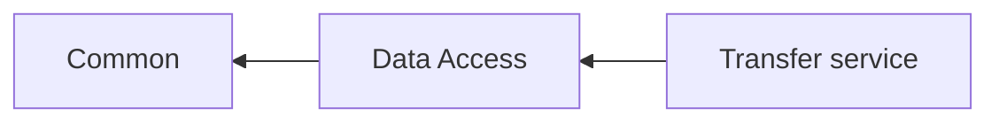

# Table of Content
- [semantic version](#semantic-version)
- [nuget generation](#nuget-generation)
- [referencing nuget package in other projects](#referencing-nuget-package-in-other-projects)
- [releasing a new major.minor version](#releasing-a-new-major-minor-version)
- [tips and tricks](#tips-and-tricks)
- [links](#links)

## Semantic version

The version number consists of 3 parts **major.minor.patch**. First 2 parts are the **major.minor** and are changed manually, but the **patch** is autogenerated as a number of commits in a git tree since last edit of major.minor. These changes are done in the **version.json** file which is located in the solution's root. 

When generating a new version number from a **feature** branch an extra tag is appended which represents a hash of the last git commit to make a version unique across multiple feature branches. The setting if branch is considered as a feature branch or not is set in **version.json** file under **publicReleaseRefSpec** variable, for backend master & develop branches are set as a release (not feature branch).

The generated version is consistent for the same commit, doesn't matter where it will be generated locally or in the gitlab pipeline.
During version generation it's not being written to any file (like assemblyinfo.cs or similar), but dynamically calculated based on the **version.json** file and git tree, injecting version variables into a BUILD process.

More information on a version generation can be found [here](https://github.com/AArnott/Nerdbank.GitVersioning#where-and-how-versions-are-calculated-and-applied) 

## Nuget generation

#### In gitlab pipeline

For any successful run the pipeline generates and pushes the nuget package with semantic version corresponding to a git commit into nuget server.
For master & develop branch it will push to nuget.org, for feature branch it will push to a private feed (To be setup)

**N.B.** Curently Pipeline pushes generated nuget from any branch to nuget.org as no private nuget feed exists.

#### Locally

Locally, a new nuget package can be created with any of the following methods:

- In Visual Studio, right click on a Project responsible for nuget creation and select **Pack** (Package will be in bin/{Debug|Release} dir) 
- In Visual Studio, in Project properties in Package tab select "Generate Nuget package on build" to create it everytime the Project is built. (Package will be in bin/{Debug|Release} dir)  **N.B.** don't commit this change
- In the command line from the directory of the solution run a command: *dotnet pack [ProjectDir] -c Debug|Release -o out*

**Tip:** One can always look at the gitlab-ci.yml file in the root of the solution to find exact command for nuget generation in Gitlab pipeline. The same command can be reused locally to produce a package.

## Referencing Nuget package in other projects 

During development of a new feature in a web service (Transfer service, NSI plugin etc) it is common that changes are required in nuget dependency (Common, DataAccess etc). In this case while testing it is recommended to create local package as described [here](#locals) with prerelease versions (containing git commit ID). 

**N.B.** Once the feature is done it's important to follow the order of creating a pull request/merging with a develop branch. Order should be starting from the bottom dependency and going Up. For every pull-request iteration the steps are:

1. Update references of bottom dependency if any, to use a release version (without git commit ID)
2. Commit project file to a feature branch with updated references
3. Create pull request
4. Merge to develop branch
5. Wait until gitlab pipeline runs and submits a new package to a nuget feed
6. Continue with next level dependency if any

Pull request order for example dependency graph 



1. Common nuget
2. DataAccess nuget
3. Transfer service

It's OK to push your code referencing intermediate nuget packages to a feature branch, *provided nuget changes are commited first and nuget package is pushed to a private nuget feed*, so the code can be compiled.

**Tip:** In order to reference a package with git commit hash (generated from a feature branch), either check "Include prerelease" checkbox in Nuget Browse dialog or insert/change Reference directly in a Project file.

**Tip:** In order to setup local nuget storage from file system in VS from the top **Tools** menu select Nuget Package Manager->Package Manager Settings->Package Sources and add a local folder where you will put your local nugets.

**Tip:** Locally when nuget packages are being frequently updated an alternative to creating a new nuget version each time (which would require a new git commit) would be [clearing nuget cache](#tips-and-tricks) and build nuget with the same version.

## Releasing a new **major.minor** version

Releasing a new **major.minor** version is a manual process and has to be agreed on by the team. 
This process consist of these steps:

- The new branch is created with the name of the version, vX.Y, where X and Y are the new values for the major and minor version
- The file **version.json** is updated with a new X.Y version
- The file **changelog.md** is updated with the release notes of added features, fixed bugs etc
- The merge request is created to merge the branch to the develop/master branch
- The merge is proceeded

## Tips and Tricks

Build nuget Release package in the *out* directory (relative to a project directory) 

```yaml
dotnet pack -c Release -o out
```

Clear the local nuget cache 

```yaml
dotnet nuget locals all --clear
```

## Links

- Semantic version manifesto https://semver.org/
- Nuget, used in .Stat Suite CORE for semver auto generation https://github.com/AArnott/Nerdbank.GitVersioning