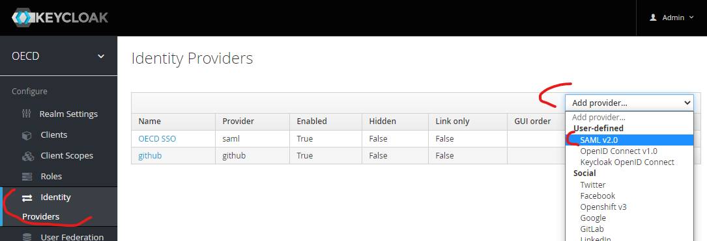
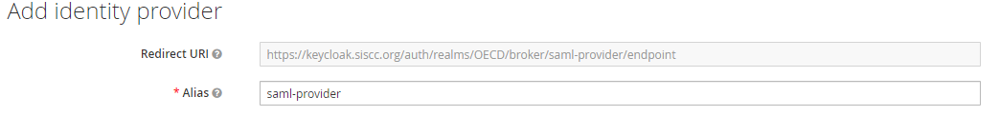
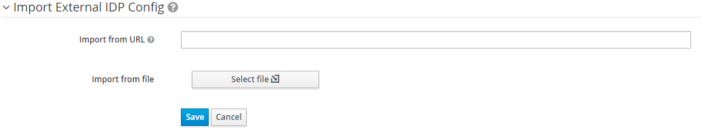
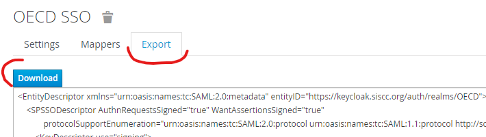
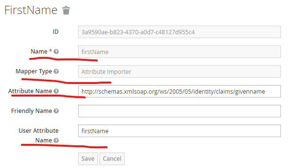

# Configure ADFS as a SAML provider to Keycloak

1. Add a new SAML provider

2. Start configuration by giving an unique to your realm **alias** for a provider 

3. Scroll to the bottom of the page & continue with Import adfs (ldap) configuration (through url or a file)

4. Once import is done, **Single Sign-ON Service URL** should be pre-filled. You can go on and fill in the rest of the fields like in the screenshot bellow:

5. Once all fields are filled, save a form, proceed with the 'Export' tab and click the **download** button. Import keycloak configuration on the ADFS side.  
Once this is done, the main configuration is complete and connection should function.

## Add attribute mappings

The last step is to map claims coming from ADFS to Keycloak attributes. Go to **Mappers** tab and create mappings for **firstName** & **lastName** claims. Use built in **Attribute Importer** as a Mapper type.

|Name|Attribute Name|User Attribute Name
|--|--|--
|firstName|http://schemas.xmlsoap.org/ws/2005/05/identity/claims/givenname|firstName
|lastName|http://schemas.xmlsoap.org/ws/2005/05/identity/claims/surname|lastName
